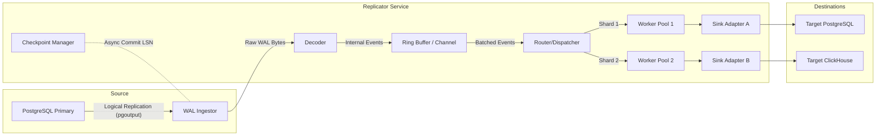
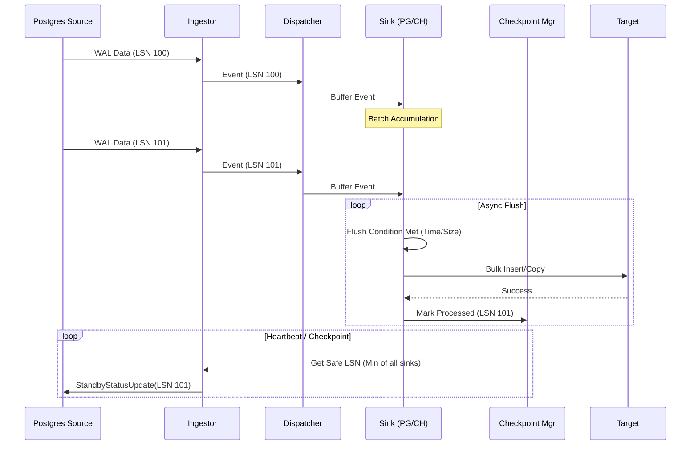

# System Design: High-Availability Replication Service

## 1. High-Level Architecture

The system follows a **Source-Pipeline-Sink** architecture designed for high throughput and fault tolerance.



### Core Components

1.  **Ingestor**: Connects to the PostgreSQL replication slot. It is a single-threaded reader (limitation of PG protocol) that pushes raw bytes or decoded messages into the pipeline.
2.  **Decoder**: Parses `pgoutput` binary messages into a strongly-typed internal event structure (`Insert`, `Update`, `Delete`, `Commit`).
3.  **Buffer**: A bounded queue (channel or ring buffer) to handle backpressure. If the sinks are slow, we must stop reading from the source to avoid OOM.
4.  **Router/Dispatcher**: Distributes events to workers.
    *   *Ordering Key*: Primary Key or Shard Key. Events for the same row MUST go to the same worker to preserve order.
5.  **Workers**: Stateless goroutines that accumulate batches and flush to sinks.
6.  **Checkpoint Manager**: Tracks the "Safe LSN". We can only acknowledge an LSN to the source once **ALL** sinks have successfully persisted the data up to that LSN.

## 2. Sequence Diagrams

### Normal Replication Flow



## 3. Go Package Layout

```
.
├── cmd
│   └── replicator
│       └── main.go          # Entry point, config loading, signal handling
├── internal
│   ├── config               # Configuration struct and parsing
│   ├── source
│   │   └── postgres         # pgx-based WAL listener
│   ├── pipeline
│   │   ├── decoder.go       # pgoutput parsing
│   │   ├── dispatcher.go    # Fan-out logic
│   │   └── checkpoint.go    # LSN tracking
│   ├── sink
│   │   ├── postgres.go      # Postgres sink implementation
│   │   └── clickhouse.go    # ClickHouse sink implementation
│   └── telemetry            # Metrics and Logging wrappers
├── pkg
│   └── types                # Shared types (Event, Row, LSN)
└── go.mod
```

## 4. Recovery & Reliability

### Data Loss Prevention (At-Least-Once)
*   **Source**: We use a Replication Slot. Postgres retains WAL logs until we acknowledge them.
*   **Ack Strategy**: We maintain a `LowWaterMark` LSN. This is the highest LSN that has been successfully written to ALL sinks.
*   **Crash Recovery**: On restart, we query the Replication Slot (or our external checkpoint store) for the restart LSN. We request the stream starting from that LSN.
*   **Duplication**: Since we restart from the last *committed* LSN, we might replay events that were processed but not yet acknowledged.
    *   *Postgres Sink*: Use `INSERT ON CONFLICT` or idempotent `MERGE`.
    *   *ClickHouse Sink*: Use `ReplacingMergeTree` to deduplicate by ID/Version, or accept duplicates if analytical precision allows.

### Failure Scenarios
1.  **Sink Down**: The worker retries with exponential backoff. The internal buffer fills up. The Ingestor stops reading. Postgres accumulates WAL.
    *   *Risk*: Postgres disk fills up.
    *   *Mitigation*: Monitoring on `replication_slot_size`.
2.  **Replicator Crash**: Process dies. In-memory buffers are lost.
    *   *Recovery*: Restart -> Connect to Slot -> Replay from last Ack LSN.
3.  **Network Partition**: Connection to Source lost.
    *   *Recovery*: `pgx` handles reconnection. We must ensure we re-verify the slot exists.

## 5. Performance & Scaling

*   **Throughput**: Target 50k+ events/sec per instance.
*   **Batching**: Critical for ClickHouse. We will use `time.Ticker` (e.g., 1s) and `BatchSize` (e.g., 10k rows).
*   **Concurrency**:
    *   Decoding is CPU bound.
    *   Sinking is IO bound.
    *   We can parallelize Sinking by sharding on Primary Key.
*   **Horizontal Scaling**:
    *   Postgres Logical Replication is single-stream per slot.
    *   To scale horizontally, we must shard the *Source* (e.g., different publications for different tables) and run multiple Replicator instances, each consuming a different publication/slot.

## 6. Operational Model

*   **Deployment**: Docker container / Kubernetes Pod.
*   **Health Checks**: `/healthz` endpoint checking connectivity to Source and Sinks.
*   **Metrics**:
    *   `replicator_lag_bytes`: Bytes behind source.
    *   `replicator_events_processed_total`: Counter.
    *   `replicator_batch_size`: Histogram.
    *   `replicator_sink_latency`: Histogram.
*   **Logs**: Structured JSON logs (slog).

## 7. Future Proofing

*   **Pluggable Sinks**: The `Sink` interface allows adding Kafka/S3 later.
*   **Schema Evolution**:
    *   *Current*: We assume schema exists on destination.
    *   *Future*: Listen for DDL events (if supported by plugin) or query `information_schema` on startup to map types.
